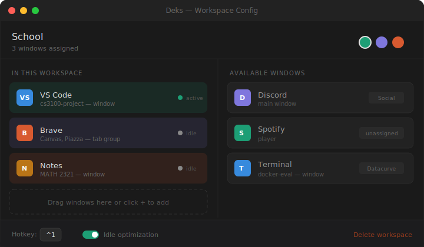

<p align="center">
  
</p>

<h1 align="center">deks</h1>

<p align="center">
  <strong>The workspace manager macOS deserves.</strong>
</p>

<p align="center">
  Switch between complete working environments — apps, browser windows, tabs — instantly.<br>
  No animations. No clutter. No wasted RAM.
</p>

<p align="center">
  <a href="https://github.com/NPX2218/deks/releases/latest">
    
  </a>
  <a href="https://github.com/NPX2218/deks/releases">
    
  </a>
  <a href="https://github.com/NPX2218/deks/blob/main/LICENSE">
    
  </a>
  <a href="https://github.com/NPX2218/deks/stargazers">
    
  </a>
  
  
</p>

<p align="center">
  <a href="#install">Install</a> •
  <a href="#features">Features</a> •
  <a href="#how-it-works">How it works</a> •
  <a href="#configuration">Configuration</a> •
  <a href="#building-from-source">Build from source</a> •
  <a href="#roadmap">Roadmap</a>
</p>

---

<p align="center">
  
</p>

---

## The problem

You juggle multiple contexts every day — school, freelance projects, social media, personal stuff. macOS Spaces is too clunky: you can't assign specific **browser windows** to specific spaces, switching has a slow swipe animation, and idle workspaces still eat your RAM.

Existing tools work at the **app level** — so "Brave" is either visible or hidden. You can't split one browser into "school Brave" and "social Brave."

**Deks fixes this.** It works at the **window level**.

## Install

### Download (recommended)

Download the latest `.dmg` from [**Releases**](https://github.com/NPX2218/deks/releases/latest):

> **[⬇ Download Deks for macOS](https://github.com/NPX2218/deks/releases/latest/download/Deks.dmg)**

Requires macOS 13.0 (Ventura) or later. Supports both Apple Silicon and Intel Macs.

### Free unsigned release path (no paid Apple Developer account)

If you do not have a paid Apple Developer account, you can still distribute Deks on GitHub.

- Build and upload a `.zip` or `.dmg` release artifact.
- Tell users the app is unsigned and not notarized.
- Include first-launch trust steps in the release notes.

Suggested first-launch steps for users:

1. Move `Deks.app` to Applications.
2. Right-click `Deks.app` and choose Open.
3. Click Open in the warning dialog.
4. If blocked, go to System Settings > Privacy & Security and click Open Anyway.
5. After granting Accessibility permission, open the Deks popup/settings and reorganize windows into the correct workspaces so the initial layout matches your intent.

Optional terminal fallback for advanced users:

```bash
xattr -dr com.apple.quarantine /Applications/Deks.app
```

### Homebrew

```bash
brew install --cask deks
```

### Build from source

See [Building from source](#building-from-source) below.

## Features

### 🪟 Window-level workspace switching

Not just apps — individual windows. Three Brave windows can live in three different workspaces.

### ⚡ Instant hotkey switching

Each workspace gets a configurable hotkey (default: `⌃1`, `⌃2`, `⌃3`...). Zero animation. Instant.

### 🎨 Named & colored workspaces

Custom name, custom color. The color shows in the menu bar, quick switcher, and the HUD overlay.

<p align="center">
  
</p>

### 📊 Menu bar widget

Always-visible colored dot + workspace name in the menu bar. Click for a dropdown of all workspaces.

### 🔎 Quick switcher

Press `⌥Tab` to open a Spotlight-style overlay. Type to filter, arrow keys to navigate, Enter to switch.

### 💤 Idle optimization

Background workspaces can be frozen using `SIGSTOP`/`SIGCONT`. Your Social apps don't eat RAM while you're coding. They resume instantly when you switch back.

### 🚀 Launch on login

Deks boots silently via `SMAppService` every time your Mac starts.

### 📌 Floating windows

Pin specific windows (Apple Music, Messages) to stay visible across all workspace switches.

### 🖥 Native HUD overlay

A gorgeous translucent overlay flashes on screen when you switch workspaces — like the macOS volume indicator.

## How it works

Deks uses the macOS Accessibility API (`AXUIElement`) to enumerate and control individual windows. When you switch workspaces, it hides all non-workspace windows and shows the ones that belong to your active workspace. No virtual desktops, no macOS Spaces — just smart window visibility management.

```
┌─────────────────────────────────────┐
│          WorkspaceManager           │
│  • switchTo(workspace)              │
│  • assignWindow(window, workspace)  │
├───────────┬─────────────────────────┤
│ WindowTracker    │    IdleManager   │
│ • AXUIElement    │  • SIGSTOP/CONT │
│ • CGWindowList   │  • Per-workspace │
└───────────┴─────────────────────────┘
```

## Configuration

Deks stores its config in `~/Library/Application Support/Deks/`:

| File               | Contents                                          |
| ------------------ | ------------------------------------------------- |
| `workspaces.json`  | Workspace definitions, window assignments, colors |
| `preferences.json` | Hotkeys, idle timeout, new window behavior        |

### New window behavior

When a new window opens that isn't assigned to any workspace:

| Mode                      | Behavior                                    |
| ------------------------- | ------------------------------------------- |
| **Auto-assign** (default) | Joins the currently active workspace        |
| **Prompt**                | Notification asks which workspace to assign |
| **Floating**              | Visible in all workspaces                   |

### Hotkeys

| Default     | Action                  |
| ----------- | ----------------------- |
| `⌃1` – `⌃9` | Switch to workspace 1–9 |
| `⌥Tab`      | Open quick switcher     |
| `⌃⇧N`       | Create new workspace    |

All hotkeys are configurable in Settings.

## Building from source

```bash
# Prerequisites
# - Swift 5.9+ / Xcode 15.0+
# - macOS 13.0+

# Clone
git clone https://github.com/NPX2218/deks.git
cd deks

# Build and install as a macOS app bundle
./scripts/build-app.sh
./scripts/install-app.sh

# Or build with Swift Package Manager directly
swift build -c release
```

## Permissions

Deks requires **Accessibility** permission to manage windows. On first launch, macOS will prompt you to grant this in System Settings → Privacy & Security → Accessibility.

If you install an unsigned build from GitHub, macOS Gatekeeper may block first launch until you approve it via right-click Open (or Open Anyway in Privacy & Security).

After Accessibility is enabled, open the Deks popup and quickly reorganize window assignments once so future switches behave predictably.

### Avoid repeated re-approval during local builds

When reinstalling locally, replace the app **in place** instead of deleting/re-adding it:

```bash
./scripts/install-app.sh
```

For the best chance of keeping permission stable across updates, use a consistent signing identity:

```bash
DEKS_SIGN_IDENTITY="Apple Development: Your Name (TEAMID)" ./scripts/install-app.sh
```

If macOS still shows Deks as disabled, toggle Deks off and on in Accessibility once, then click **Check Again** in the in-app setup window.

If you are developing locally without an Apple signing identity, Deks is ad-hoc signed and macOS may treat rebuilt binaries as new trust targets.

To reinstall without changing the binary/signature hash while testing permissions:

```bash
DEKS_SKIP_BUILD=1 ./scripts/install-app.sh
```

To run a clean permission reset and reinstall in one command:

```bash
DEKS_RESET_ACCESSIBILITY=1 ./scripts/install-app.sh
```

If macOS permission state is badly stuck, use a global reset (this resets Accessibility permissions for all apps):

```bash
DEKS_RESET_ACCESSIBILITY=1 DEKS_RESET_SCOPE=global ./scripts/install-app.sh
```

No other permissions are required. Deks does not access your files, camera, microphone, or network.

## Privacy

Deks is private by design:

- All data is stored locally in `~/Library/Application Support/Deks/`
- No analytics, telemetry, or crash reporting
- No network requests whatsoever
- Fully open source — audit the code yourself

## Roadmap

- [x] Window-level workspace management
- [x] Instant hotkey switching
- [x] Menu bar widget
- [x] Quick switcher overlay
- [x] Idle optimization (SIGSTOP/SIGCONT)
- [x] Launch on login
- [x] Floating (pinned) windows
- [x] Native HUD overlay
- [ ] Browser tab group awareness
- [ ] Workspace wallpapers
- [ ] Focus mode integration
- [ ] Workspace snapshots & restore across restarts
- [ ] Smart rules engine (auto-assign by URL, app, display)
- [ ] Launch sequences (one-click boot all apps for a workspace)
- [ ] Built-in time tracking per workspace
- [ ] Dock morphing per workspace
- [ ] Multi-monitor independence
- [ ] Workspace templates & community sharing
- [ ] Shortcuts / Raycast integration

## Contributing

Contributions are welcome! Please see [CONTRIBUTING.md](CONTRIBUTING.md) for guidelines.

## License

[MIT](LICENSE) — use it, fork it, build on it.

## Acknowledgments

Deks was inspired by the limitations of macOS Spaces, FlashSpace, and the dream of a workspace manager that actually understands browser windows.

---

<p align="center">
  
  <br>
  <sub>your desk, your rules</sub>
</p>
