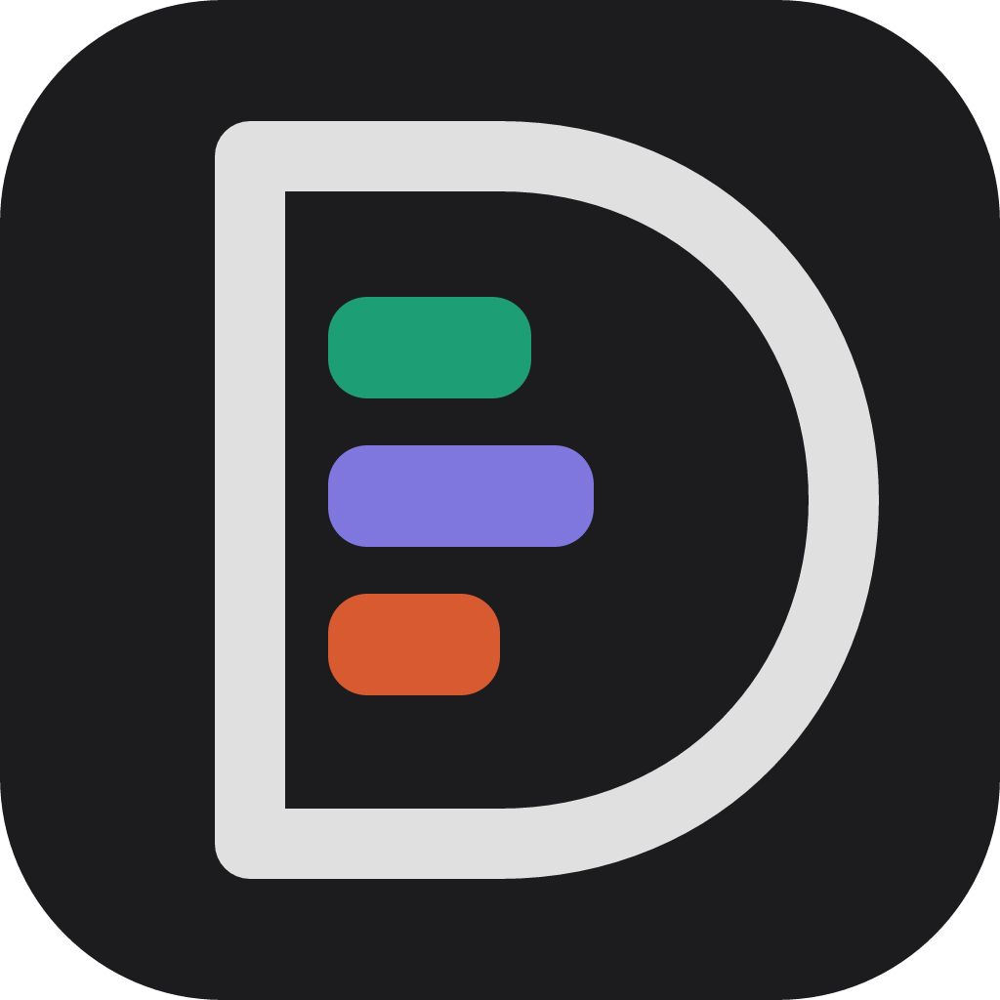
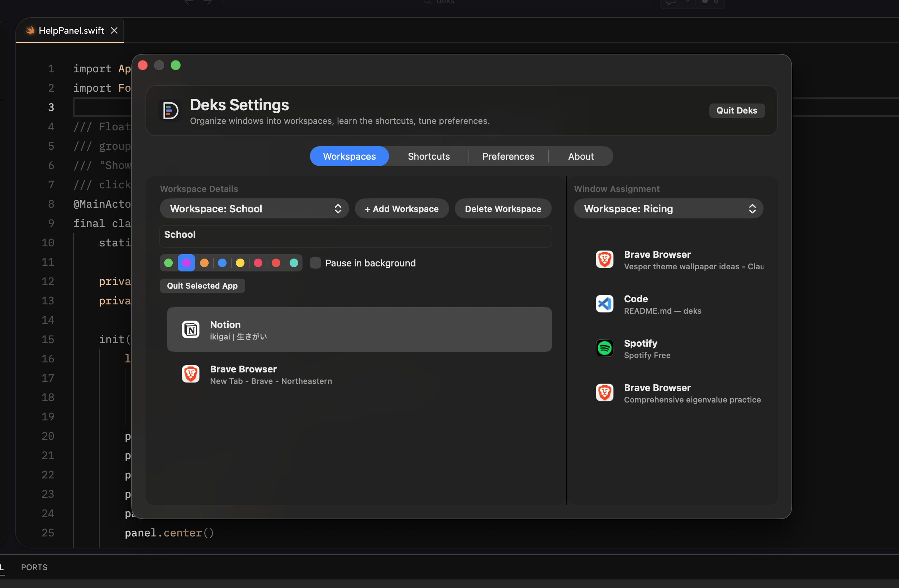
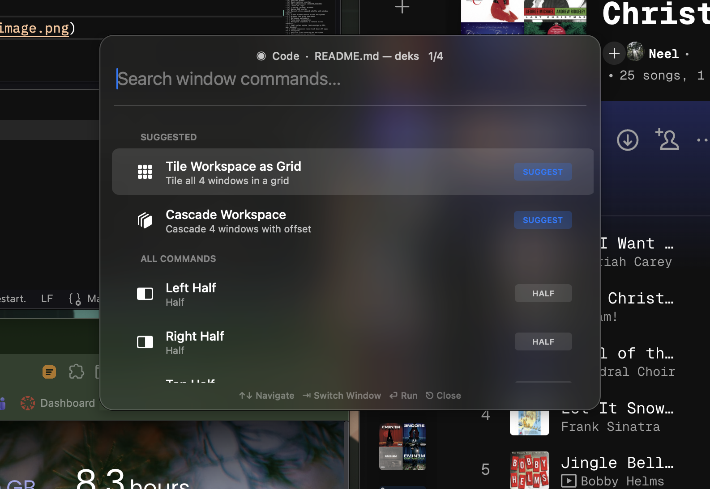
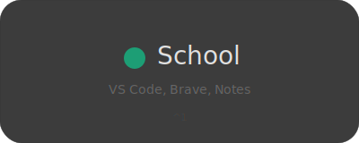
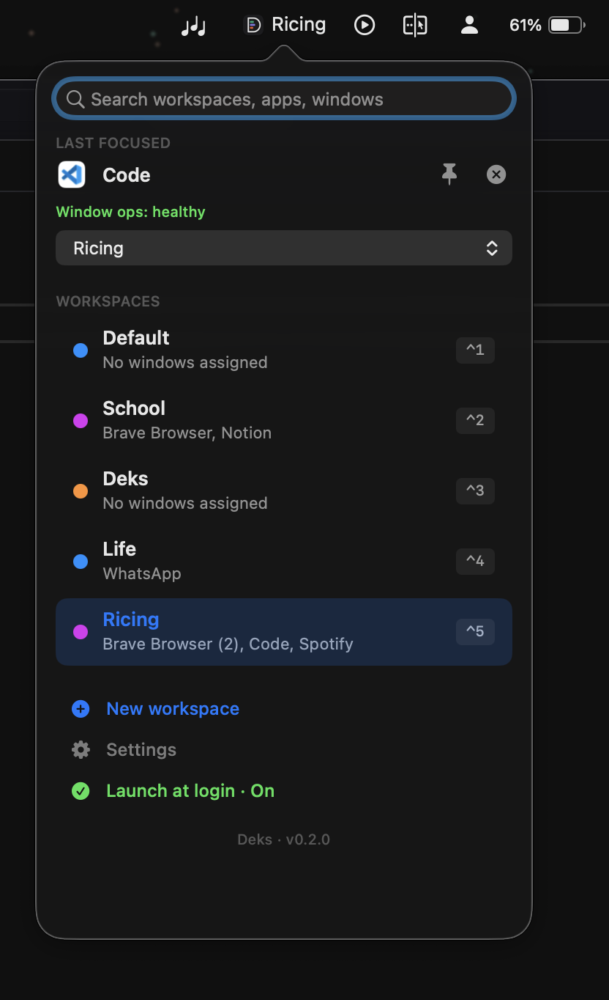
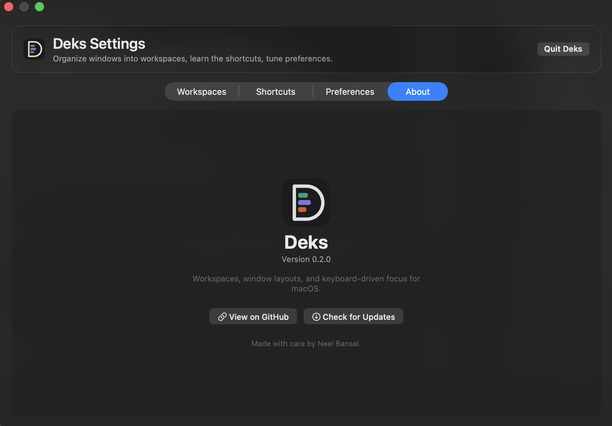

<p align="center">
  
</p>

<h1 align="center">deks</h1>

<p align="center">
  <strong>The workspace manager macOS deserves.</strong>
</p>

<p align="center">
  Switch between complete working environments — apps, browser windows, tabs — instantly.<br>
  No animations. No clutter. No wasted RAM.
</p>

<p align="center">
  <a href="https://github.com/NPX2218/deks/releases/latest">
    
  </a>
  <a href="https://github.com/NPX2218/deks/releases">
    
  </a>
  <a href="https://github.com/NPX2218/deks/blob/main/LICENSE">
    
  </a>
  <a href="https://github.com/NPX2218/deks/stargazers">
    
  </a>
  
  
</p>

<p align="center">
  <a href="#install">Install</a> •
  <a href="#features">Features</a> •
  <a href="#how-it-works">How it works</a> •
  <a href="#configuration">Configuration</a> •
  <a href="#building-from-source">Build from source</a> •
  <a href="#development">Development</a> •
  <a href="#roadmap">Roadmap</a>
</p>

---

<p align="center">
  
</p>

---

## The problem

You juggle multiple contexts every day — school, freelance projects, social media, personal stuff. macOS Spaces is too clunky: you can't assign specific **browser windows** to specific spaces, switching has a slow swipe animation, and idle workspaces still eat your RAM.

Existing tools work at the **app level** — so "Brave" is either visible or hidden. You can't split one browser into "school Brave" and "social Brave."

**Deks fixes this.** It works at the **window level**.

## Install

### Download (recommended)

Grab the latest build from [**Releases**](https://github.com/NPX2218/deks/releases/latest):

> **[⬇ Download Deks for macOS](https://github.com/NPX2218/deks/releases/latest/download/Deks.zip)**

Requires macOS 13.0 (Ventura) or later. Supports both Apple Silicon and Intel Macs.

### First-launch steps

Because Deks is distributed outside the Mac App Store, macOS Gatekeeper may block the first launch:

1. Move `Deks.app` into `/Applications`.
2. Right-click `Deks.app` and choose **Open**.
3. Click **Open** in the Gatekeeper warning.
4. If still blocked, go to **System Settings → Privacy & Security** and click **Open Anyway**.
5. Grant Accessibility permission when prompted (required for window management).

Terminal fallback if Gatekeeper is stuck:

```bash
xattr -dr com.apple.quarantine /Applications/Deks.app
```

### Build from source

See [Building from source](#building-from-source) below.

## Features

### 🪟 Window-level workspace switching

Not just apps — individual windows. Three Brave windows can live in three different workspaces.

https://github.com/user-attachments/assets/ce81d7e5-1215-480e-aa16-223f8b02f9f3

### 🎛 Command palette

Press `⌃⌥W` anywhere to open a Raycast-style palette that's aware of the current workspace. Apply window layouts (halves, quarters, thirds, workspace tiling, cascade, grid), fuzzy-search every open window and focus it (auto-switching workspaces when needed), or evaluate quick math inline — all keyboard-first. Context-aware suggestions at the top pick layouts based on window count and screen aspect.

<p align="center">
  
</p>

### ⚡ Instant hotkey switching

Each workspace gets a configurable hotkey (default: `⌃1`, `⌃2`, `⌃3`...). Zero animation. Instant.

### 🎨 Named & colored workspaces

Custom name, custom color. The color shows in the menu bar, quick switcher, and the HUD overlay.

<p align="center">
  
</p>

### 📊 Menu bar widget

Always-visible colored dot + workspace name in the menu bar. Click for a dropdown of all workspaces, the last-focused window with quick actions, and footer shortcuts for creating workspaces or opening settings.

<p align="center">
  
</p>

### 🔎 Quick switcher

Press `⌥Tab` to open a Spotlight-style overlay. Type to filter, arrow keys to navigate, Enter to switch.

### 💤 Idle optimization

Background workspaces can be frozen using `SIGSTOP`/`SIGCONT`. Your Social apps don't eat RAM while you're coding. They resume instantly when you switch back.

### 🚀 Launch on login

Deks boots silently via `SMAppService` every time your Mac starts.

### 📌 Floating windows

Pin specific windows (Apple Music, Messages) to stay visible across all workspace switches.

### 🖥 Native HUD overlay

A gorgeous translucent overlay flashes on screen when you switch workspaces — like the macOS volume indicator.

## How it works

Deks uses the macOS Accessibility API (`AXUIElement`) to enumerate and control individual windows. When you switch workspaces, it hides all non-workspace windows and shows the ones that belong to your active workspace. No virtual desktops, no macOS Spaces — just smart window visibility management.

```
┌──────────────────────────────────────────────────┐
│                WorkspaceManager                  │
│  • switchTo(workspace)                           │
│  • assignWindow(window, workspace)               │
│  • Global hotkey registration                    │
├────────────────────┬─────────────────────────────┤
│   WindowTracker    │       IdleManager           │
│ • AXUIElement      │  • SIGSTOP / SIGCONT        │
│ • CGWindowList     │  • Per-workspace pause      │
├────────────────────┼─────────────────────────────┤
│  CommandPalette    │   WindowLayoutManager       │
│ • Raycast-style UI │  • Halves / quarters        │
│ • Window search    │  • Grid / columns / rows    │
│ • Inline math      │  • Cascade / maximize       │
└────────────────────┴─────────────────────────────┘
```

## Configuration

Deks stores its config in `~/Library/Application Support/Deks/`:

| File               | Contents                                          |
| ------------------ | ------------------------------------------------- |
| `workspaces.json`  | Workspace definitions, window assignments, colors |
| `preferences.json` | Idle timeout, menu-bar logo toggle, developer diagnostics, workspace-switch modifier, window gap |
| `Logs/`            | Rolling telemetry logs (only populated when developer diagnostics is enabled) |

When a new window opens that isn't assigned to any workspace, it joins the currently active workspace automatically.

### Hotkeys

| Default      | Action                                                   |
| ------------ | -------------------------------------------------------- |
| `⌃1` – `⌃9`  | Switch to workspace 1–9                                  |
| `⌃⇧1` – `⌃⇧9`| Send the focused window to workspace 1–9 without switching |
| `⌥Tab`       | Quick switcher — jump to previous workspace (flip-flop)  |
| `⌥Tab` (hold)| Cycle forward through workspaces (tap Tab while holding) |
| `⌥⇧Tab`      | Cycle backward through workspaces                        |
| Release `⌥`  | Commit the selected workspace                            |
| `⎋`          | Cancel the cycle without switching                       |
| `⌃⇧N`        | Create new workspace                                     |
| `⌃⇧D`        | Toggle Deks on/off (with HUD confirmation)               |
| `⌃⌥W`        | Open the command palette (layouts, window search, calculator) |

Inside the command palette:

| Key          | Action                                                   |
| ------------ | -------------------------------------------------------- |
| `↑` `↓`      | Navigate commands (skips section headers)                |
| `⇥` / `⇧⇥`   | Cycle the target window within the active workspace      |
| `⏎`          | Run the selected layout, focus a window, or copy a calculator result |
| `⎋`          | Close the palette                                        |
| Click outside| Dismisses the palette                                    |

The quick switcher behaves like macOS `⌘Tab`: a quick `⌥Tab` and release jumps back to the previous workspace (great for flip-flopping between two). Hold `⌥` and keep tapping `Tab` to cycle forward, `⇧Tab` to go backward, `⎋` to cancel. Start typing any letter to fall back to the search-filter mode.

Settings shows a live preview of every edit: drag a window from one workspace to another and the window hides or reappears on screen immediately so you can see what the workspace will look like.

The settings window is tabbed: **Workspaces** (drag-and-drop window assignment, per-workspace color and idle behavior), **Shortcuts** (full keyboard reference), **Preferences** (menu bar logo, window gap, diagnostics, reset), and **About** (version, GitHub, credits). The per-workspace switch modifier is persisted in preferences.

<p align="center">
  
</p>

## Building from source

```bash
# Prerequisites
# - Swift 5.9+ / Xcode 15.0+
# - macOS 13.0+

# Clone
git clone https://github.com/NPX2218/deks.git
cd deks

# Build and install as a macOS app bundle
./scripts/build-app.sh
./scripts/install-app.sh

# Or build with Swift Package Manager directly
swift build -c release
```

## Permissions

Deks requires **Accessibility** permission to manage windows. On first launch, macOS prompts you to grant it in **System Settings → Privacy & Security → Accessibility**.

If macOS still shows Deks as disabled after you enable it, toggle the switch off and on once, then click **Check Again** in Deks's in-app setup window.

No other permissions are required. Deks does not access your files, camera, microphone, or network.

## Development

Tips for contributors and anyone rebuilding Deks locally.

Keep accessibility permission stable across rebuilds by using a consistent signing identity:

```bash
DEKS_SIGN_IDENTITY="Apple Development: Your Name (TEAMID)" ./scripts/install-app.sh
```

Reinstall without rebuilding (useful when only testing permission flows):

```bash
DEKS_SKIP_BUILD=1 ./scripts/install-app.sh
```

Clean accessibility state and reinstall in one step:

```bash
DEKS_RESET_ACCESSIBILITY=1 ./scripts/install-app.sh
```

Global accessibility reset (resets permissions for every app on the system — use sparingly):

```bash
DEKS_RESET_ACCESSIBILITY=1 DEKS_RESET_SCOPE=global ./scripts/install-app.sh
```

Ship a signed, notarized release zip to `release/`:

```bash
DEKS_SIGN_IDENTITY="Apple Development: Your Name (TEAMID)" \
  ./scripts/release-harden.sh 0.3.0
```

## Privacy

Deks is private by design:

- All data is stored locally in `~/Library/Application Support/Deks/`
- No analytics, telemetry, or crash reporting
- No network requests whatsoever
- Fully open source — audit the code yourself

## Roadmap

- [x] Window-level workspace management
- [x] Instant hotkey switching
- [x] Menu bar widget
- [x] Quick switcher overlay
- [x] Idle optimization (SIGSTOP/SIGCONT)
- [x] Launch on login
- [x] Floating (pinned) windows
- [x] Native HUD overlay
- [x] Raycast-style command palette with window layouts
- [x] Global window search across workspaces
- [ ] Browser tab group awareness
- [ ] Workspace wallpapers
- [ ] Focus mode integration
- [ ] Workspace snapshots & restore across restarts
- [ ] Smart rules engine (auto-assign by URL, app, display)
- [ ] Launch sequences (one-click boot all apps for a workspace)
- [ ] Built-in time tracking per workspace
- [ ] Dock morphing per workspace
- [ ] Multi-monitor independence
- [ ] Workspace templates & community sharing
- [ ] Rebindable palette and workspace hotkeys

## Contributing

Contributions are welcome! Please see [CONTRIBUTING.md](CONTRIBUTING.md) for guidelines.

## License

[MIT](LICENSE) — use it, fork it, build on it.

## Acknowledgments

Deks was inspired by the limitations of macOS Spaces, FlashSpace, and the dream of a workspace manager that actually understands browser windows.

---

<p align="center">
  
  <br>
  <sub>your desk, your rules</sub>
</p>